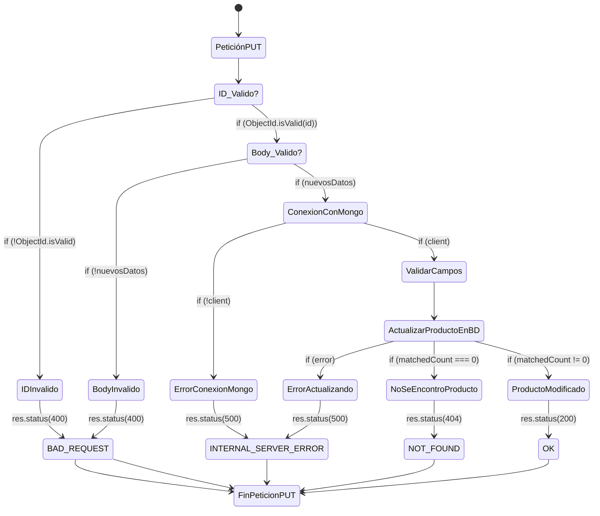

# Trailerflix
## Segunda Pre-entrega 
### Grupo 13
----
- [Integrantes](#integrantes)
- [Para Iniciar Servidor](#para-iniciar-servidor)
- [Dependencias](#dependencias)
- [Peticiones](#peticiones)
	- [Busqueda de Productos](#busquedas-de-productos)
		- [Busqueda General](#get-supermercado)
		- [Busqueda por Codigo](#get-supermercadocodigo)
		- [Busqueda por Nombre](#get-supermercadonombrenombre)
		- [Busqueda por Precio](#get-supermercadoprecioprecio)
		- [Busqueda por Categoria](#get-supermercadocategoriacategoria)
	- [Agregar Producto](#agregar-producto)
	- [Modificar Producto](#modificar-producto)
	- [Eliminar Producto](#eliminar-producto)
- [Diagrama de flujo de Petición PUT](#diagrama-de-flujo-de-put-supermercadoid)

----
#### Integrantes
* Sofia D'Ascanio
* Yanina Anahí Mylek
* María de los Ángeles Rechach

#### Para Iniciar Servidor

* ` cd pre-entrega-2 `
* ` npm start `

#### Dependencias

* ` npm install dotenv` 
* ` npm install mongodb` 


-----
## Peticiones
| PETICIÓN | URL | DESCRIPCIÓN |
|:--------:|-----|-------------|
| GET | [/supermercado](/supermercado) | Obtener todos los productos |
| GET | [/supermercado/:codigo](/supermercado) | Obtener un producto especifico con su número de *codigo* |
| GET | [/supermercado/nombre/:nombre](/supermercado) | Obtener todos los productos que coincidan con *nombre*|
| GET | [/supermercado/precio/:precio](/supermercado) | Obtener todos los productos que tengan un precio mayor o igual a *precio*|
| GET | [/supermercado/precio/:categoria](/supermercado) | Obtener todos los productos que coincidan con *categoria*|
| POST | [/supermercado](/supermercado) | Agregar un nuevos producto |
| PUT | [/supermercado/:id](/supermercado) | Modificar un producto existente |
| DELETE | [/supermercado/:id](/supermercado) | Eliminar un producto existente |


-------
## Busquedas de Productos
### ` GET /supermercado ` 

Para listar todos los productos del supermercado
``` 
GET /supermercado
```

### ` GET /supermercado/:codigo `

Para obtener un producto especifico, indicando el numero de código
``` 
GET /supermercado/5678
```

### ` GET /supermercado/nombre/:nombre ` 
Para obtener todos los productos donde el nombre coincida total o parcialmente con ***:nombre***
``` 
GET /supermercado/nombre/queso 
```

### ` GET /supermercado/precio/:precio `
Para obtener todos los productos donde precio sea mayor o igual a ***:precio***
``` 
GET /supermercado/precio/3 
``` 

### ` GET /supermercado/categoria/:categoria `
Para obtener todos los productos donde la categoria coincida total o parcialmente con ***:categoria***
``` 
GET /supermercado/categoria/limpieza
```
----
## Agregar Producto
### ` POST /supermercado `

Para agregar un producto nuevo al supermercado. Los campos son: ***codigo***, ***nombre***, ***categoria*** y ***precio***.
* ***codigo*** debe ser un número mayor a 0
* ***nombre*** y ***categoria*** deben ser un string valido
* ***precio*** debe ser un número mayor o igual a 0
``` javascript
	{
		"codigo": 9999,
		"nombre": "Chocolate",
		"categoria": "Comestible",
		"precio": 120
}

```
-----
## Modificar Producto
### ` PUT /supermercado/:id `

Para modificar los valores de un producto existente. Se puede modificar un campo, o varios.

Solo se pueden modificar los campos: ***codigo***, ***nombre***, ***categoria*** y ***precio***. 
* ***codigo*** debe ser un número mayor a 0
* ***nombre*** y ***categoria*** deben ser un string valido
* ***precio*** debe ser un número mayor o igual a 0
```
PUT /supermercado/684ae9b21856c75eaeb678b3
```
``` javascript
	{	
		"codigo": 5668,
		"nombre": "Harina",
		"categoria": "Comestible",
		"precio": 40
	}

```
------
## Eliminar Producto
### ` DELETE /supermercado/:id `

Para eliminar un producto del supermercado, se indica el ID del producto.
``` 
DELETE /supermercado/684ae9b21856c75eaeb678b3
```

-----
### Diagrama de flujo de PUT /supermercado/:id

